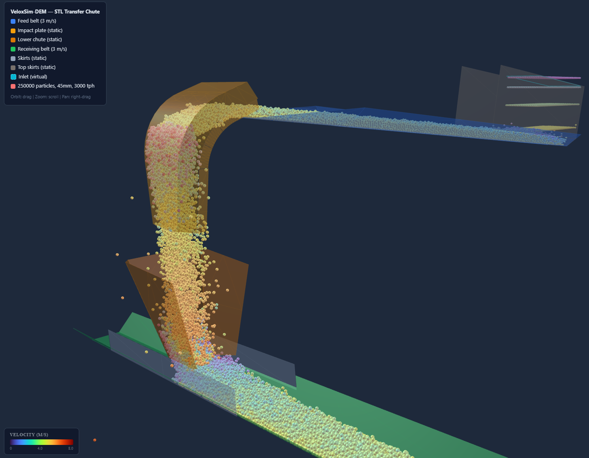
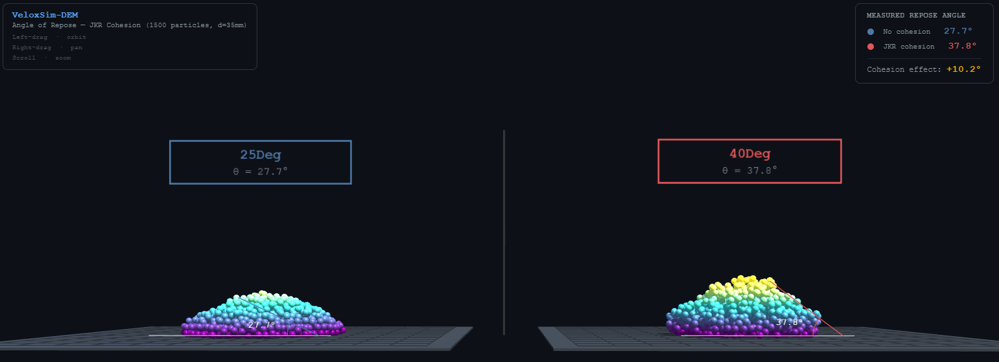

# VeloxSim-DEM

GPU-accelerated Discrete Element Method (DEM) simulation engine built on [NVIDIA Warp](https://github.com/NVIDIA/warp).

Built by VeloxSim Tech Pty Ltd (www.veloxsim.com) and Sam Wong.

## Features

- **Hertz-Mindlin contact model** with tangential spring tracking and viscous damping
- **Coulomb friction** with static and dynamic coefficients
- **Type C EPSD rolling resistance** (elastic-plastic spring-dashpot, history-dependent)
- **JKR cohesion/adhesion** with configurable surface energy
- **Particle-particle collision** via spatial hash grid broad-phase
- **Particle-mesh collision** via BVH mesh queries on arbitrary triangular meshes
- **In-plane dynamics** (conveyor belts) with surface velocity parameter
- **3D mesh import** (OBJ/STL via trimesh)
- **Velocity Verlet integration**
- **Fully GPU-resident** via NVIDIA Warp kernels
- **Google Turbo Colormp** It's a rainbow-style colormap designed to improve upon Jet by being smoother and perceptually uniform

## Requirements

- Python 3.10+
- NVIDIA GPU with CUDA support
- [NVIDIA Warp](https://github.com/NVIDIA/warp)
- NumPy, trimesh, matplotlib (for plots)

## Installation

```bash
pip install warp-lang numpy trimesh matplotlib
```

## Quick Start

```python
import numpy as np
from veloxsim_dem import Simulation, SimConfig, create_plane_mesh

config = SimConfig(
    num_particles=5000,
    particle_radius=0.005,
    particle_density=2500.0,
    young_modulus=1e7,
    poisson_ratio=0.3,
    restitution=0.5,
    friction_static=0.5,
    friction_dynamic=0.4,
    friction_rolling=0.01,
    cohesion_energy=0.0,
    dt=1e-5,
    gravity=(0.0, 0.0, -9.81),
)

sim = Simulation(config)
positions = np.random.uniform(-0.1, 0.1, (5000, 3)).astype(np.float32)
positions[:, 2] = np.linspace(0.01, 0.5, 5000)
sim.initialize_particles(positions)

floor = create_plane_mesh(origin=(0, 0, 0), normal=(0, 0, 1), size=2.0)
sim.add_mesh(floor)

for i in range(1000):
    sim.step()

pos = sim.get_positions()      # (N, 3) numpy array
ke = sim.get_kinetic_energy()  # total KE in Joules
```

## Included Tests

### Conveyor Transfer Chute

Simulates bulk material flow through an STL transfer chute geometry with dynamic particle insertion.



```bash
python test_stl_chute.py --radius 0.0225 --belt-speed 3.0 --tonnage 3000 --sim-time 10
```

STL geometry files are in the `STL/` directory. After running, use the viewer to regenerate the animation:

```bash
python chute_viewer.py
```

### Angle of Repose

Validates JKR cohesion by measuring angle of repose using the cylinder lift method.



```bash
python test_repose.py
```

After running, generate the 3D viewer:

```bash
python repose_viewer.py
```

## Configuration

All simulation parameters are set via `SimConfig`:

| Parameter | Default | Description |
|---|---|---|
| `num_particles` | 1000 | Number of spherical particles |
| `particle_radius` | 0.005 m | Particle radius |
| `particle_density` | 2500 kg/m^3 | Material density |
| `young_modulus` | 1e7 Pa | Young's modulus |
| `poisson_ratio` | 0.3 | Poisson's ratio |
| `restitution` | 0.5 | Coefficient of restitution |
| `friction_static` | 0.5 | Static friction coefficient (mu_s) |
| `friction_dynamic` | 0.4 | Dynamic friction coefficient (mu_d) |
| `friction_rolling` | 0.01 | Rolling friction coefficient (mu_r) |
| `cohesion_energy` | 0.0 J/m^2 | Particle-particle JKR surface energy |
| `cohesion_energy_wall` | None | Particle-wall JKR surface energy (defaults to `cohesion_energy`) |
| `global_damping` | 0.0 1/s | Viscous drag coefficient |
| `dt` | None (auto) | Timestep (auto-computed from Rayleigh wave speed if None) |
| `gravity` | (0, 0, -9.81) | Gravity vector |
| `max_contacts_per_particle` | 32 | Contact history slots per particle |
| `hash_grid_dim` | None (auto) | Spatial hash grid resolution |

### Separate wall cohesion

The `cohesion_energy_wall` parameter allows independent control of particle-wall adhesion. This is useful for modelling scenarios where wall material properties differ from bulk material, such as sticky material on smooth steel walls:

```python
config = SimConfig(
    cohesion_energy=5.0,       # particle-particle: 5 J/m^2
    cohesion_energy_wall=0.5,  # particle-wall: 0.5 J/m^2 (smooth walls)
)
```

When `cohesion_energy_wall` is `None` (default), it falls back to `cohesion_energy` for backward compatibility.

## Contact Model

The Hertz-Mindlin model computes:

- **Normal force**: F_n = (4/3) E* sqrt(R*) delta_n^(3/2)
- **Normal damping**: F_nd = -2 sqrt(5/6) beta sqrt(S_n m*) v_n
- **Tangential force**: F_t = -S_t delta_t (accumulated incrementally)
- **Coulomb limit**: |F_t| <= mu_s |F_n| (static), capped at mu_d |F_n| (kinetic)
- **Rolling resistance**: Type C EPSD with plastic cap at mu_r R* |F_n|
- **Cohesion**: F_c = 1.5 pi gamma R* (JKR pull-off with linear ramp beyond contact)

## License

See [LICENSE](LICENSE).
