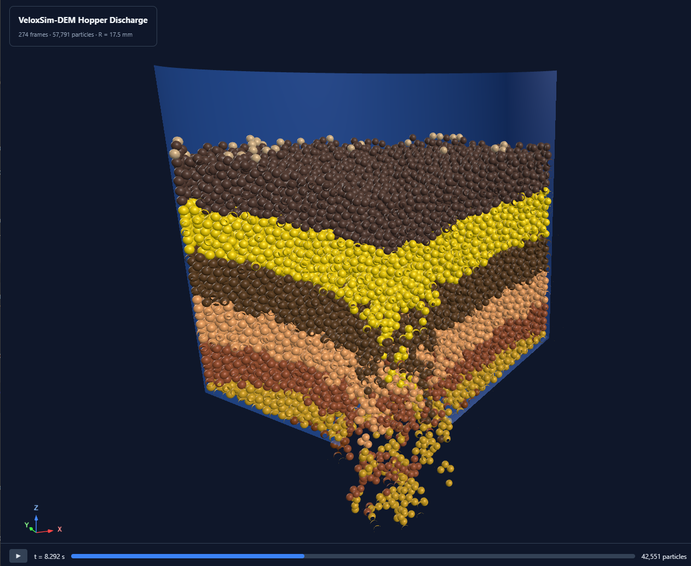

# Hopper Discharge Example

A DEM simulation of gravity-driven hopper discharge, used to
study flow regimes (mass flow, funnel flow, ratholing, arching) as a
function of material properties and hopper geometry.



*Hopper2.stl with 57,791 particles (R = 17.5 mm) shown in the Layers
colour mode.  The classic V-shaped distortion of the middle layers is
the visual signature of funnel flow — material drains preferentially
through the centre while the wall layers remain comparatively
undisturbed.*

## Overview

The simulation runs in two phases:

### Phase 1 — Settling (outlet plugged)

Particles are placed on a grid inside the hopper with a **plug mesh**
blocking the outlet.  A light global damping term is applied during
settling to dissipate kinetic energy faster, and the simulation runs
until the packed bed reaches a quiescent state (mean particle speed
below 0.1 m/s, no further rearrangement).  Settling uses zero cohesion
regardless of the discharge cohesion settings — this avoids extreme
contact forces from JKR adhesion during the initial grid-to-packed
transition.  Settled positions are saved to `packed_positions.npy` for
reuse.

### Phase 2 — Discharge (outlet open)

A new simulation is created with the hopper mesh only (no plug).  The
settled particle positions are loaded, the outlet opens, and particles
discharge under gravity.  Each frame is recorded for the viewer, and
particles that fall below the hopper bottom are parked at a dormant
position so they stop contributing to contact detection.

## Files

```
examples/hopper_discharge/demo_hopper.py        # Simulation runner
hopper_viewer.py                                # Interactive 3D HTML viewer generator (repo root)
examples/hopper_discharge/STL/Hopper2.stl       # Example conical hopper geometry
examples/hopper_discharge/STL/plug2.stl         # Plug mesh that blocks the outlet during settling
```

## Quick Start

Default run with 35 mm particles and the bundled STL files:

```bash
python examples/hopper_discharge/demo_hopper.py \
  --hopper-stl examples/hopper_discharge/STL/Hopper2.stl \
  --plug-stl examples/hopper_discharge/STL/plug2.stl \
  --radius 0.0175 \
  --sim-time 15
```

This runs both phases (settling + discharge), saves results to
`~/Desktop/veloxsim_hopper/`, and opens an interactive HTML viewer when
done.

### Funnel flow study

Crank up rolling friction and cohesion to induce funnel flow:

```bash
python examples/hopper_discharge/demo_hopper.py \
  --hopper-stl examples/hopper_discharge/STL/Hopper2.stl \
  --plug-stl examples/hopper_discharge/STL/plug2.stl \
  --radius 0.0175 \
  --friction-static 1.0 \
  --friction-rolling 1.5 \
  --cohesion 25 \
  --cohesion-wall 80 \
  --sim-time 15
```

### Reusing a packed bed

Phase 1 (settling) is the slow part — often 30-60 minutes for a dense
packed bed with tight convergence criteria.  Phase 2 (discharge) is
typically 2-3 minutes.  To iterate on material properties without
re-settling, save the packed positions once and replay them:

```bash
# First run: full settling + discharge, saves packed_positions.npy
python examples/hopper_discharge/demo_hopper.py --hopper-stl examples/hopper_discharge/STL/Hopper2.stl --plug-stl examples/hopper_discharge/STL/plug2.stl

# Subsequent runs: skip settling, just discharge with different cohesion
python examples/hopper_discharge/demo_hopper.py \
  --hopper-stl examples/hopper_discharge/STL/Hopper2.stl \
  --packed ~/Desktop/veloxsim_hopper/packed_positions.npy \
  --cohesion 50 --cohesion-wall 150
```

## Command-line Options

| Flag | Default | Description |
|---|---|---|
| `--hopper-stl` | required | Path to hopper STL file (mm units) |
| `--plug-stl` | None | Plug mesh blocking the outlet during settling (auto-generated plane if omitted) |
| `--floor-stl` | None | Optional floor / catch-bin STL below the outlet |
| `--stl-scale` | 0.001 | STL unit conversion (default: mm &rarr; m) |
| `--radius` | 0.0175 | Particle radius in metres (35 mm diameter) |
| `--n-particles` | auto | Particle count (auto-estimated from hopper volume if omitted) |
| `--bulk-density` | 2000 | Bulk material density kg/m^3 |
| `--packing-fraction` | 0.55 | Target packing fraction for particle-count estimation |
| `--friction-static` | 0.5 | Static friction coefficient |
| `--friction-dynamic` | 0.4 | Dynamic friction coefficient |
| `--friction-rolling` | 0.01 | Rolling friction coefficient |
| `--restitution` | 0.3 | Coefficient of restitution |
| `--cohesion` | 0.0 | Particle-particle JKR surface energy J/m^2 |
| `--cohesion-wall` | None | Particle-wall JKR surface energy J/m^2 (defaults to `--cohesion`) |
| `--sim-time` | 15 | Discharge simulation time in seconds |
| `--settle-max-steps` | 3M | Max steps for the settling phase |
| `--packed` | None | Path to pre-packed positions .npy file (skips settling) |
| `--output-dir` | `~/Desktop/veloxsim_hopper` | Output directory |
| `--no-viewer` | false | Skip viewer generation |

## Viewer

The generated `hopper_viewer.html` is a self-contained interactive 3D
viewer using Three.js.  It has three colour modes:

### Solid
Plain red, useful for getting an overall impression of bed motion.

### Velocity
Particles coloured by speed magnitude using a
blue &rarr; cyan &rarr; green &rarr; yellow &rarr; red colour bar.
Configurable min/max range.

### Layers
Each particle is coloured by its **initial vertical layer** using 8
alternating earth tones (saddlebrown, goldenrod, sienna, sandybrown,
etc.).  As the simulation progresses, each particle keeps its layer
colour — so the layer deformation immediately reveals the flow pattern:

- **Mass flow**: layers drop uniformly, stay roughly horizontal
- **Funnel flow**: centre layers dip into a V-shape, wall layers stay flat
- **Ratholing**: narrow central channel cuts through flat layers
- **Arching**: layers are completely undeformed — material locked in place

This is the classic coloured-sand layer technique used in bulk
materials handling research.  Layer IDs are assigned from the first
frame z-position, then propagated through subsequent frames via
nearest-neighbour tracking.

### Other controls

- **Clip** — toggle a Y=0 clipping plane to see a cross-section through
  the hopper centre.  When enabled, the camera snaps to a side view.
- **Cinema** — full-screen mode for video recording, with large HUD
  showing time and particle count.
- **Playback speed** — 0.2x to 5.0x.
- **Scrubber** — click to jump to any simulation time.
- **Axis gizmo** — small X/Y/Z indicator in the bottom-left corner.

### Regenerating the viewer from saved results

If you want to tweak viewer settings without rerunning the simulation:

```bash
python hopper_viewer.py \
  --results ~/Desktop/veloxsim_hopper/hopper_results.json \
  --output ~/Desktop/veloxsim_hopper/hopper_viewer.html
```

## Implementation Notes

### Particle placement

Initial particles are placed on a tight regular grid (2.01&times;radius
spacing) inside the hopper bounding box, then filtered against the
hopper mesh geometry — either using `trimesh.contains()` if the mesh is
watertight, or a z-indexed cylindrical heuristic otherwise.  The fill
zone extends 0.5&times;hopper-height above the rim so particles falling
in during settling compact fully.

### Settling convergence

Settling terminates when ALL of the following are sustained for 5
consecutive diagnostic checks:

1. Kinetic energy below a count-scaled threshold
2. Maximum particle speed below 0.1 m/s
3. Maximum displacement since last check below 5% of particle radius

Convergence is measured only on particles inside the hopper walls —
particles sitting on top of the bed above the rim can drift slowly
without walls to contain them, and would otherwise prevent convergence
forever.

### Particle deletion

Particles that fall below the hopper bottom (`h_lo[2] - 0.5 m`) are
parked at z = 10000 m with zero velocity and zero contact count.  This
keeps the active particle count small and prevents the kinetic energy
metric from being dominated by free-falling discharged material.
