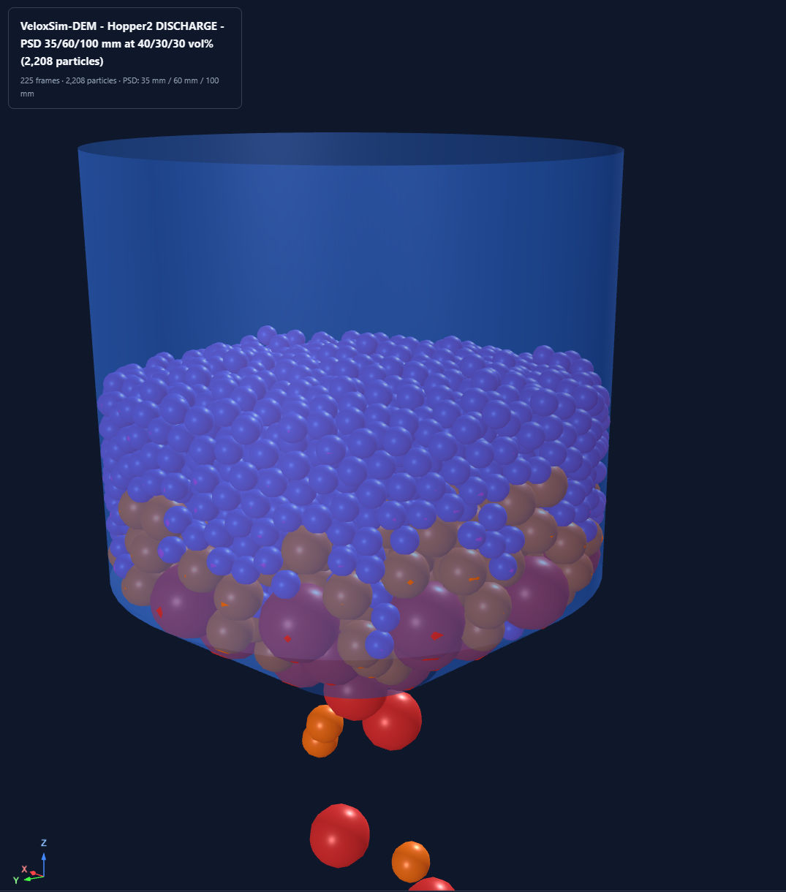

# PSD Hopper Example

DEM simulation of a conical hopper filled with a
**particle size distribution** (PSD).  Particle counts are
**back-calculated from a target bulk density** so the fill matches the
real packing that a material would achieve — not an arbitrary grid size
chosen by the user.



*Screenshot from the generated `psd_hopper_discharge.html` viewer
shortly after the plug is removed.  Hopper2.stl filled at 2000 kg/m³
bulk density with a 35 / 60 / 100 mm radius PSD at 40 / 30 / 30 vol %
(2,208 particles, 225 captured frames).  Blue = 35 mm class, brown =
60 mm, red = 100 mm — note the larger particles settled to the bottom
and the first few are starting to fall through the outlet.*

## Overview

The simulation runs in two phases, mirroring the hopper workflow
documented in [`HOPPER.md`](HOPPER.md):

### Phase 1 — Settling (outlet plugged)

`Hopper2.stl` is closed at the bottom with `plug2.stl` (a thin disc at
z = 0).  Particles spawn in a tight **cylindrical column above the
hopper opening** (R = 0.60 m < hopper R = 0.73 m) so nothing falls
outside.  Spawning is done **per size class** on independently-spaced
grids — the small 35 mm particles pack densely on a 77 mm grid, the
100 mm particles on a 220 mm grid, etc. — which keeps the spawn column
short (~2 m) rather than the ~30 m a naïve max-radius grid would need.

A light global damping term (5 s⁻¹) is applied during settling to
dissipate kinetic energy faster, and the simulation runs until the mean
particle speed drops below **0.01 m/s**.  The settled state is saved to
`settled_state.npz` for reuse.

### Phase 2 — Discharge (outlet open)

A fresh simulation is built with `Hopper2.stl` alone (no plug) and a
floor plane at z = -2.5 m to catch the discharged material.  The saved
positions + radii are loaded and remapped onto the new simulation's
per-particle assignments (particles within a class are interchangeable,
so the mapping is class-by-class).  Global damping is turned off so the
material flows naturally under gravity.

Frames are captured every 500 steps (≈15–20 fps at dt = 1e-4), saved to
`psd_hopper_discharge.json`, and fed into the Three.js viewer.

## Back-calculated particle counts

Instead of picking a particle count out of the air (the classic "7³ grid
because it looks nice" trap), counts are derived from physical inputs:

| Input | Value |
|-------|-------|
| Bulk density target | 2000 kg/m³ |
| Particle (solid) density | 2500 kg/m³ |
| PSD (by volume fraction) | 35 mm (40 %), 60 mm (30 %), 100 mm (30 %) |
| Fill height | z = 0.80 m |

The derivation is:

1. Compute **hopper internal volume** up to the fill height analytically
   from the measured cone-plus-cylinder profile (cone z = 0 → 0.343,
   cylinder z = 0.343 → 1.527, R = 0.7317).
2. Total particle mass: `M = ρ_bulk · V_fill`.
3. Total solid volume: `V_s = M / ρ_particle`.
4. Per class, the mass/volume fraction matches the PSD → the **count
   fraction** is `f_i = vol_frac_i · S / V_i` where `V_i` is the
   individual particle volume and `S = 1 / Σ(vol_frac_j / V_j)`.
5. Total count: `N = V_s / Σ(f_i · V_i)`.

For the defaults this yields **2,208 particles** (1,870 × 35 mm, 278 × 60 mm,
60 × 100 mm), a bulk density of 2000 kg/m³ on recovery, and volume
fractions within 0.1 % of target.  The `ParticleSizeDistribution` is
fed count percentages (84.7 / 12.6 / 2.7 %), so its internal
count-based assignment produces the intended mass mix.

## Files

The example ships **two scripts** (one per phase) plus the STL meshes.
The engine `veloxsim_dem.py` and the shared Three.js viewer generator
`hopper_viewer.py` live at the repo root; each example script inserts
the repo root on `sys.path` at import time so you can invoke them from
anywhere without needing to install the package.

```
examples/psd_hopper/test_psd_hopper.py    Phase 1 — settling; writes settled_state.npz + psd_hopper_test.png
examples/psd_hopper/discharge_html.py     Phase 2 — discharge; writes the interactive Three.js HTML viewer
examples/psd_hopper/STL/Hopper2.stl       Conical hopper mesh (mm units)
examples/psd_hopper/STL/plug2.stl         Plug disc that closes the outlet during Phase 1
hopper_viewer.py                          Three.js viewer generator (PSD-aware; repo root, shared)
veloxsim_dem.py                           DEM engine (GPU, Warp; repo root)
```

## Quick Start

### 1. Phase 1 — settle the bed

```bash
python examples/psd_hopper/test_psd_hopper.py
```

Prints the back-calculated counts, runs ~31,000 steps (≈26 s wall clock
on RTX 3080 Ti), writes a static PNG (`psd_hopper_test.png`), and caches
the settled state to `settled_state.npz`.

### 2. Phase 2 — discharge + HTML viewer

```bash
python examples/psd_hopper/discharge_html.py
```

Loads `settled_state.npz`, runs the 15 s discharge, writes the JSON
frame payload, and generates the self-contained
`psd_hopper_discharge.html` viewer (Three.js).  End-to-end ≈ 2 min.
Open the HTML in any modern browser; see the [Viewer](#viewer) section
for controls.

## Observed flow: intermittent arching → drain

For the default PSD the largest particles have D_outlet / d_particle =
500 / 200 = **2.5**, below the ~3–6 guideline for reliable flow.  The
simulation shows a textbook intermittent-arching pattern:

| Phase | Time | Behaviour |
|-------|------|-----------|
| Initial drain | 0 – 2 s | ~30 particles exit (fines near the outlet) |
| Stall | 2 – 8 s | Large particles form a stable arch; bed barely drops |
| Collapse | 8 – 12 s | Arch destabilises under column weight |
| Flush | 12 – 14.6 s | Bulk drain — ~2,100 particles exit in ~2 s |
| Empty | t ≈ 14.6 s | 0 particles remain in the hopper |

Short runs (e.g. `DISCHARGE_TIME = 4.0`) can mislead you into thinking
the arch is permanent.  The 15 s default run shows the full stick-slip
behaviour.

## Viewer

`discharge_html.py` produces a self-contained Three.js viewer identical
to the one documented in [`HOPPER.md`](HOPPER.md) with a few additions
for PSD support:

- **Correct per-particle size**: each instance is scaled by
  `RADII[i] / R_max` so the 35 mm, 60 mm and 100 mm spheres render at
  their real radii.  (The upstream viewer used a single uniform
  `CONFIG.radius` — patched here to read `CONFIG.radii`.)
- **PSD-aware solid colour**: in **Solid** mode, particles are coloured
  by class (blue / orange / red), matching the PyVista renders.
- **Metadata line** shows the PSD (e.g. `PSD: 35 mm / 60 mm / 100 mm`)
  rather than a single scalar radius.
- **Velocity** and **Layers** modes continue to work unchanged and are
  the most informative for this example:
  - *Velocity* — highlights the thin streaming column above the outlet
  - *Layers* — the initial z-layer colouring reveals the funnel-flow
    pattern: the centre column drains first and drags its colour
    downwards while the wall layers stay roughly in place until the
    end.
- **Y = 0 clipping plane** — slice the hopper vertically to watch the
  arch form and break directly through the cross-section.

## Configuration

Key tunables are defined near the top of each script:

| Constant | Value | Where | Description |
|---|---|---|---|
| `BULK_DENSITY` | 2000 kg/m³ | `test_psd_hopper.py` | Target bulk density for back-calc |
| `PARTICLE_DENSITY` | 2500 kg/m³ | both | Solid material density |
| `FILL_HEIGHT` | 0.80 m | `test_psd_hopper.py` | Target fill level in the hopper |
| `PSD_RADII` | [0.035, 0.060, 0.100] m | both | Particle size classes |
| `PSD_VOL_FRACS` | [0.40, 0.30, 0.30] | both | Volume fractions per class |
| `GLOBAL_DAMPING` | 5.0 s⁻¹ (settle), 0.0 (discharge) | both | Viscous drag for settling |
| `MEAN_SPEED_THRESHOLD` | 0.01 m/s | `test_psd_hopper.py` | Settling convergence criterion |
| `DISCHARGE_TIME` | 15.0 s | `discharge_html.py` | Phase-2 sim duration |
| `Z_FLOOR` | -2.5 m | `discharge_html.py` | Floor plane below the outlet |
| `SPAWN_CYLINDER_R` | 0.60 m | `test_psd_hopper.py` | Constrained feed inlet radius |
