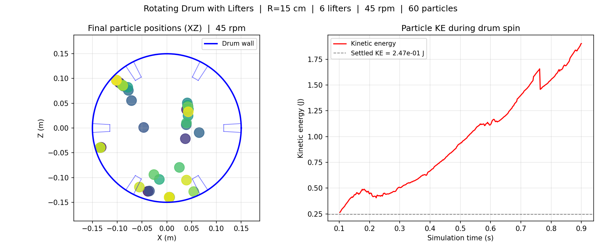
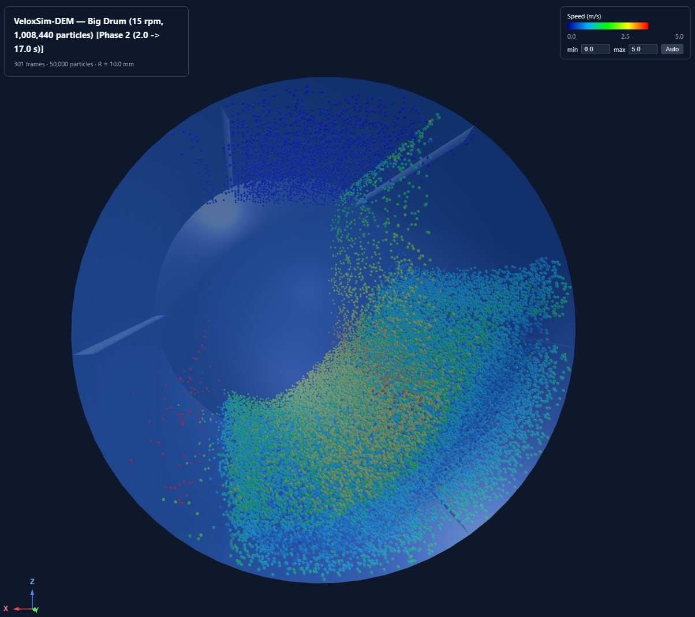

# Rotating Drum Example

DEM simulation of a horizontally-spinning cylindrical drum with six
radial **lifter blades** attached to the inner wall.  This is the
reference validation example for **kinematic mesh rotation** — the
geometry physically rotates each timestep, and the contact solver
sees the moving wall (including the contact arm `omega x (p - origin)`)
exactly as a rigid body should.



*Final particle positions and kinetic-energy trace from the bundled
`example_rotating_drum.py` (R = 15 cm, L = 30 cm, six lifters,
60 particles at R = 10 mm, 45 rpm = `omega = 4.712 rad/s` for 0.8 s
≈ 270° of rotation).  Lifters carry particles up the wall and shed
them across the bed — the resulting cascading-flow KE settles around
7.7× the value of a quiet, settled bed at the same fill, and ≈4× a
smooth-wall drum at the same rpm.  The lifters do mechanical work
on the bed; friction alone cannot.*



*The same engine path scaled up: `examples/big_drum/` runs an
R = 1.5 m, L = 4 m drum at 15 rpm (`omega = 1.5708 rad/s`,
Froude ≈ 0.38, cascading regime) with **1,008,440 particles** at
R = 10 mm.  Captured at t = 17 s of Phase 2; particles coloured by
speed (blue 0 m/s → red 5 m/s).  The cataracting toe and the lifter-
shed cascade are clearly visible.  Total wallclock 5 h 49 min on a
single RTX 3080 Ti Laptop, peak GPU memory 3.28 GB — driven by
exactly the same `set_mesh_angular_velocity` + per-step BVH refit
path used in the small-drum example above.*

## Overview

The simulation runs in two phases:

### Phase 1 — Settling (drum stationary)

Particles are placed at random non-overlapping positions inside the
drum, then settled under gravity with a light global-damping term to
shed kinetic energy quickly.  At the end of Phase 1 the bed is at
rest at the bottom of the drum, the drum is still angular-velocity
zero, and the settled kinetic energy `KE_settled` is recorded as the
denominator for the spin-phase comparison.

### Phase 2 — Spin (drum rotating about Y)

Global damping is set to zero (clean Coulomb friction only), the drum
is given an angular velocity `omega` about its central Y axis via
`Simulation.set_mesh_angular_velocity(...)`, and the simulation runs
for `SPIN_STEPS` more steps.  Every `FRAME_STRIDE` steps the particle
positions and the drum's `(position, quaternion)` pose are recorded
into a frame buffer — the viewer applies the quaternion to the
rest-frame STL each frame, so the lifters are visibly carried around
with the wall.

## New dynamics settings (kinematic geometry API)

This example is the showcase for the **kinematic-mesh-motion** API
introduced alongside Phase 1 (translation) and Phase 2 (rotation).
A mesh is no longer a fixed wall — every `wp.Mesh` registered with the
simulation now carries a full rigid-body pose state that is integrated
each step.

### Per-mesh dynamics state

Every entry in `Simulation.meshes` is now a `MeshBody` with the
following dynamics fields (all default to "stationary" so existing
code is unchanged):

| Field | Type | Role |
|---|---|---|
| `linear_velocity`  | `vec3 (m/s)` | Rigid translation per step.  Vertices shift by `linear_velocity * dt`; the BVH is refitted in place. |
| `angular_velocity` | `vec3 (rad/s)` | Rigid rotation per step about `origin`.  Quaternion integrated by exact axis-angle each step. |
| `origin`           | `vec3 (m)`   | Pivot point for rotation.  The contact arm `omega x (p_contact − origin)` uses this. |
| `surface_velocity` | `vec3 (m/s)` | Conveyor-belt slip velocity tangential to the mesh surface (independent of rigid motion).  Backward-compatible with pre-Phase-1 behaviour. |
| `position`         | `vec3 (m)`   | Accumulated translation since construction (host-side bookkeeping; viewer reads this). |
| `quaternion`       | `quat (x,y,z,w)` | Accumulated rotation (host-side bookkeeping; viewer reads this). |
| `rest_points_wp`   | `wp.array(vec3)` | GPU copy of the **rest-frame** vertices.  The transform kernel rebuilds `mesh.points` from these every step, so floating-point drift cannot accumulate. |

### What `example_rotating_drum.py` actually does

The drum is added **stationary** (no motion kwargs), settled under
gravity, then spun by a single `set_mesh_angular_velocity` call at
the start of Phase 2 — same `Simulation` instance, no rebuild:

```python
import math

# Phase 1 — drum added stationary, particles settle
drum = create_drum_with_lifters_mesh(
    radius=0.15, length=0.30, n_theta=48,
    n_lifters=6, lifter_height=0.035,
    end_caps=True, device="cuda:0",
)
drum_idx = 0
sim.add_mesh(drum)               # no motion kwargs → stationary

for _ in range(SETTLE_STEPS):
    sim.step()                   # bed settles; drum does not move

# Phase 2 — start the drum spinning about its +Y axis
rpm   = 45.0
omega = rpm * 2.0 * math.pi / 60.0     # = 4.712 rad/s
sim.set_mesh_angular_velocity(
    drum_idx,
    angular_velocity=(0.0, omega, 0.0),    # rotation about +Y
    origin=(0.0, 0.0, 0.0),                # pivot at world origin
)

for step in range(SPIN_STEPS):
    sim.step()                   # vertices, BVH and contact history
                                 # are kept in sync automatically
    if step % FRAME_STRIDE == 0:
        poses = sim.get_mesh_poses()
        # [{"pos": [x, y, z], "quat": [x, y, z, w]}, ...]
        # — fed straight into the Three.js viewer payload
```

For the [`big_drum`](../examples/big_drum/) benchmark the drum spins
slower (15 rpm → `omega = 15 * 2*pi/60 = 1.5708 rad/s`) so a much
larger R = 1.5 m drum stays well below centrifuging
(Froude `omega² R / g ≈ 0.38`, cascading regime).

### Full kinematic-geometry API reference

```python
# Construction — every motion kwarg is optional and defaults to (0,0,0):
sim.add_mesh(
    mesh,
    linear_velocity   = (0.0, 0.0, 0.0),    # m/s     — rigid translation
    angular_velocity  = (0.0, 0.0, 0.0),    # rad/s   — rigid rotation about origin
    origin            = (0.0, 0.0, 0.0),    # m       — rotation pivot
    surface_velocity  = (0.0, 0.0, 0.0),    # m/s     — conveyor slip on the surface
)

# Update either rigid velocity mid-simulation:
sim.set_mesh_velocity(idx,
    linear_velocity=(0.0, 0.0, 0.5))

sim.set_mesh_angular_velocity(idx,
    (0.0, omega, 0.0),
    origin=(0.0, 0.0, 0.0))

# Read the live pose of every registered mesh (host-side, for viewers):
poses = sim.get_mesh_poses()
# → [{"pos": [x, y, z], "quat": [x, y, z, w]}, ...]
```

### Which examples exercise which path

| Example | Translation | Rotation | Lifters | Notes |
|---|---|---|---|---|
| `translating_floor` | ✔ | — | — | Vertical-rise floor; CI checks `vz → v_floor` |
| `conveyor`          | ✔ | — | — | Coulomb friction ramp; analytical-curve overlay |
| `tunneling_study`   | ✔ | — | — | Sweeps `(dt, v_wall)` to chart the safe-motion envelope |
| **`rotating_drum`** | — | ✔ | ✔ | **This file.**  Quaternion integration, contact arm, history rotation |
| `big_drum`          | — | ✔ | ✔ | 1 M+ particle benchmark with checkpoint/resume |

## Files

```
examples/rotating_drum/example_rotating_drum.py     # Simulation runner + CI test
examples/rotating_drum/rotating_drum.html           # Generated Three.js viewer
examples/rotating_drum/rotating_drum.png            # Cross-section + KE plot
veloxsim_dem.py                                     # Engine — kinematic-rotation kernels
hopper_viewer.py                                    # Shared 3D HTML viewer
```

## Quick Start

Default run (45 rpm, 16 000 spin steps, generates JSON + HTML + PNG):

```bash
python examples/rotating_drum/example_rotating_drum.py
```

Custom rpm:

```bash
python examples/rotating_drum/example_rotating_drum.py --rpm 60
```

CI acceptance test (short spin, asserts on `KE_final / KE_settled`
and that no particle has tunnelled outside the drum wall):

```bash
python examples/rotating_drum/example_rotating_drum.py --ci
```

## Command-line Options

| Flag | Default | Description |
|---|---|---|
| `--rpm` | 45 | Drum rotation speed in revolutions per minute |
| `--ci` | off | Short CI run; exits 0 on pass, 1 on fail |

All other parameters (drum geometry, particle radius, number of
particles, timestep, lifter height, frame stride, …) are constants
near the top of the script — edit there if you need a different
configuration.

